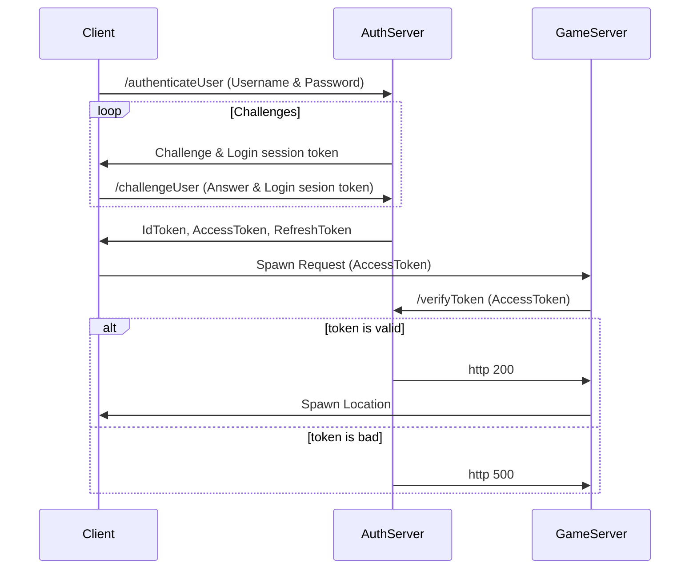
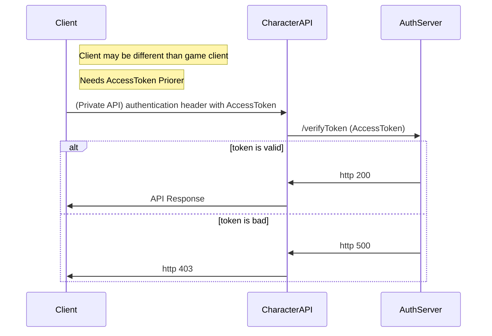

# Jzt Oct 2023

## Description
An rpg mmo style game

## Sections
There are a few core components to the system
* Client - Game client
* Server - Game server used to manage and serve data for in game, such as connected players, resources, enemies locations, as well as managing some server-based features.
* Authentication - Auth Server used to authenticate users in AWS user pool and give / validate tokens
* Character - Character Server used to serve / store / update character data. Has a REST API as well as websocket communication for real time updates from Game Server.

## Design docs
https://docs.google.com/document/d/1lITH8mZTxfJIvKmDfllnNTu1q2WSlluFcifHb9xySP4/edit

## Communication

### Client Login

### Character Rest API
